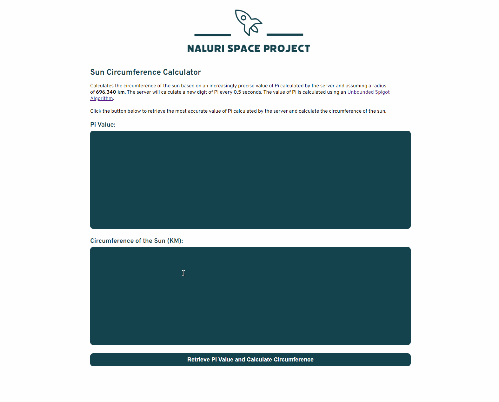

# Naluri Coding Challenge

A web application that calculates and displays the circumference of the sun based on an increasingly precise value of Pi calculated by the server and assuming a radius of 696,340 km. The server will calculate a new digit of Pi every 0.5 seconds. The value of Pi is calculated using an [Unbounded Spigot Algorithm](http://www.cs.ox.ac.uk/jeremy.gibbons/publications/spigot.pdf).

# Demo



# Getting Started

These instructions will get you a copy of the project up and running on your local machine for development and testing purposes.

## Installing

_Note: You need to have [Node.js](https://nodejs.dev/) installed before proceeding._

Clone the repository

```
git clone https://github.com/gkken/naluri-coding-challenge.git
```

Navigate into the server folder and install all dependencies

```
cd naluri-coding-challenge/server/
npm install
```

From there, navigate to the client folder to install all dependencies

```
cd ../client/
npm install
```

Once client dependencies have been installed. Start the React app from within the `client` folder

```
npm start
```

Open a new tab in the terminal, navigate to the `server` folder within the repository folder and start the server

```
cd server/
node server.js
```

Once server has started, go to the web application which is accessible at `http://localhost:3000/` and click the `Retrieve Pi Value and Calculate Circumference` button to use the application.

## Running the Tests

From the repository folder, enter the folder named "tests" and install all dependencies

```
cd tests/
npm install
```

You may run the tests by executing the following command

```
npm test
```

### pi.test.js

There are 6 tests that would check the precision of the digits of Pi generated by the algorithm, from 1 digit up to 100,000 digits. Please note that the test for 100,000 digits is disabled by default as it would lengthen the total test time from 4 seconds to 190 seconds.

If you would like to enable it, you may navigate to `/tests/pi.test.js` and un-comment the final test at line 85:

```
// test("Accurate up to 100,000 digits of Pi", () => {
//   let generator = generateDigitsOfPi();
//   let actual = "";

//   for (let counter = 0; counter < 100000; counter++) {
//     actual += generator.next().value;
//   }

//   let expected = digits100K;

//   expect(actual).toBe(expected);
// }, 50000);
```

## Built With

- [React](https://reactjs.org/)
- [Express.js](https://expressjs.com/)

## Limitations

1. While appropriate to calculate the circumference of the sun, this application is not suitable to be used to calculate the circumference of any other circles due to the method used to build the final circumference string
2. The algorithm for calculating the Pi value is not fully optimised. As a result, the calculation of 100,000 digits of Pi will take approximately 180 seconds. Calculation of Pi value and subsequently circumference, at a precision any higher than 100,000 digits is not advisable.
